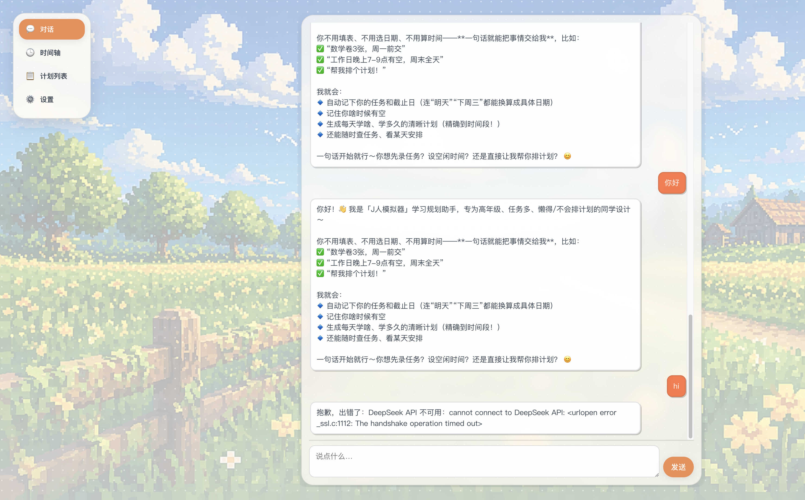
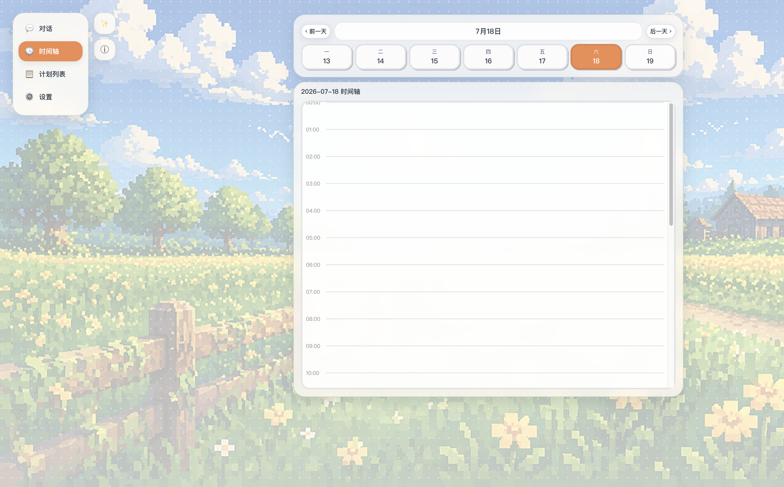
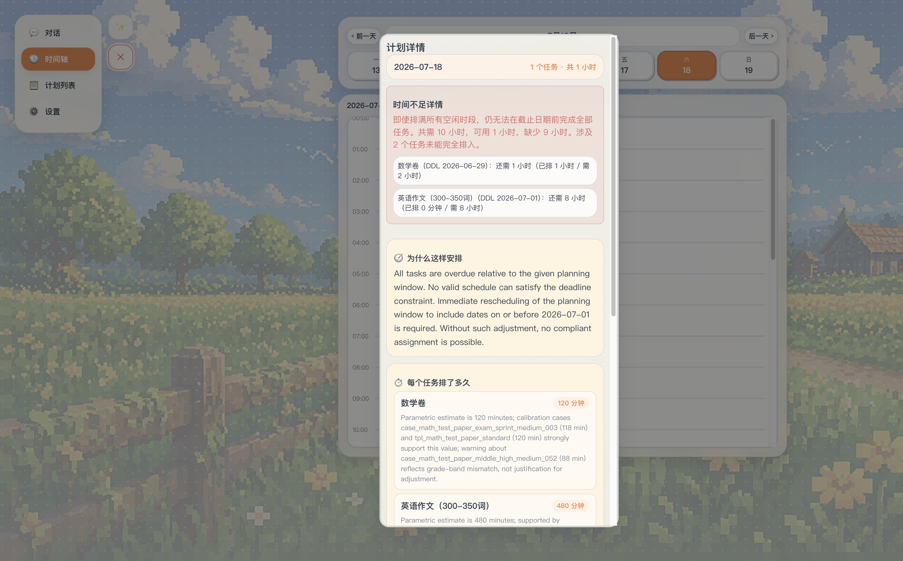
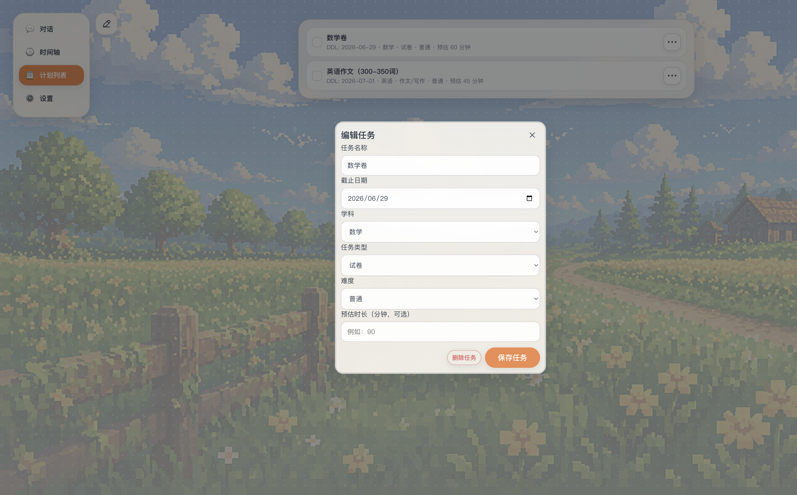

# J人模拟器 · AI 学习计划助手

> **一句话定位**：一个把主页做成「AI 聊天窗口」的学习计划网站——学生用一句话说清「要做什么 + 什么时候有空」，AI 就自动录任务、估耗时、并生成可跨天、可编辑的时间轴计划。

面向学习任务重、却不擅长自己排计划的高年级 / 高中生。你不用填四张表单，只需要像发微信一样说：
> “数学卷3张周一前，工作日晚上7点到9点有空，帮我排一下。”

剩下的交给 AI。

---

## 一、解决的问题

“J 人”（做事有计划的人）能把 DDL 拆解成每天的小任务，“P 人”做不到。真实痛点是：
- **不会估时间**：一张卷子要多久？200 个单词背多久？学生自己估不准。
- **不会排 DDL**：多个任务、多个截止日、每天空闲时间还不一样，手动排太累。
- **工具门槛高**：市面上的日程 App 全是表单和设置，录一个任务要点十下。

**J人模拟器**把这三件事合并成一句话对话：AI 负责解析、用知识库 + 个人历史**证据化估时**、再按 `DDL 优先` 的约束把任务排进你的空闲时段，排不下还会明确告诉你「时间不够，缺多少」。

---

## 二、目标用户
- 高年级 / 高中生，任务多、DDL 密集；
- 不擅长自己做时间规划、希望「每天 ≤5 分钟」搞定计划的人；
- 想要一个 PC 端、桌面优先体验的学习计划工具。

---

## 三、核心功能
- 💬 **AI 对话主页**：一句话录任务、设空闲时间、生成/查询计划（Agent + function calling 真正修改应用状态，不是只聊天）。
- 🧠 **证据化估时（RAG）**：参数化知识库（学科/任务类型/单位速率/疲劳/难度修正）+ 你的历史完成记录，融合估算每个任务耗时，估时可解释、带引用。
- 🗓️ **跨天约束排程**：任务可拆分到 DDL 前多天，只排进你的空闲时段，优先级 `deadline > 时段匹配 > 历史速度`。
- ⏱️ **时间轴可视化 / 编辑**：按分钟渲染排程方块，可点击编辑、删除任务。
- ⚠️ **时间不足告警**：需求超过可用时段时，结构化提示缺口时长与受影响任务，而不是静默失败。
- 🔐 **账号系统**：手机号 / 邮箱注册登录，密码加盐 SHA-256，会话持久化（刷新不掉登录），用户数据隔离。
- 🎯 **专注模式 / 打卡**：专注计时、任务打卡；完成记录回流成个人估时样本，越用越准。
- 🔄 **可切换模型**：DeepSeek `deepseek-chat`（默认）/ 阿里通义 `qwen-plus` / 本地 Ollama，OpenAI 兼容接口，换环境变量即可。

---

## 四、技术栈
- **后端**：Python 3 + Flask（`v0_demo/backend/app.py`），标准库 `urllib` 直连 LLM，无重依赖。
- **前端**：原生 HTML / CSS / JS 单页应用（`v0_demo/index.html` / `app.js` / `styles.css`），桌面优先，左侧导航 + 右侧动作栏 + 动画登录页。
- **LLM**：DeepSeek `deepseek-chat`（OpenAI 兼容），可切 Qwen / Ollama。
- **Agent**：`assistant_agent.py` 多轮 function calling 循环（5 个工具）。
- **RAG**：`knowledge_rag.py` + `data/knowledge/task_knowledge_v2.jsonl` 参数化知识库。
- **存储**：JSON 文件（用户状态 / 会话 / 个人历史样本），零外部数据库。

> 工程细节（Prompt / Tool Calling / Agent / Memory / RAG / Safety / Fallback / Trace）请见 **[`LLM_ENGINEERING_NOTES.md`](LLM_ENGINEERING_NOTES.md)**。

---

## 五、安装与运行

> 应用代码位于 `v0_demo/`。仅需 Python 3 与 Flask，其余为标准库。

### 1. 安装依赖
```bash
cd v0_demo/backend
python3 -m venv .venv
source .venv/bin/activate          # Windows: .\.venv\Scripts\activate
pip install -r requirements.txt
```

### 2. 配置环境变量（从模板复制，勿提交真实 key）
```bash
cp run.local.env.example run.local.env
# 编辑 run.local.env，填入你的 DEEPSEEK_API_KEY
```
`run.local.env` 已被 `.gitignore` 忽略；后端启动时由 `_load_local_env()` 自动加载。
需要的键见 `run.local.env.example`：`DEEPSEEK_API_KEY`、`DEEPSEEK_API_URL`、`DEEPSEEK_MODEL`、`AVAILABILITY_DEEPSEEK_MODEL`、`APP_PORT`。

### 3. 启动
```bash
python3 app.py
```
然后浏览器访问：**http://127.0.0.1:5001/**

> 端口说明：macOS 的 AirPlay 常占用 5000，模板默认 `APP_PORT=5001`。如需更改，改 `run.local.env` 里的 `APP_PORT` 即可。

### 4. 快速自检
```bash
curl http://127.0.0.1:5001/api/health     # 查看 deepseekApiReady 是否为 true
```

---

## 六、示例输入 / 输出

**输入（对话主页一句话）：**
> 工作日晚上7点到9点有空，数学卷3张周一前，帮我排计划。

**AI 会做（一个回合内）：**
1. `set_availability` → 把「工作日 19:00–21:00」写入每周空闲时段；
2. `add_task` → 新增任务「数学卷3张」，deadline 换算成周一日期；
3. `generate_plan` → 用知识库估时（数学卷3张≈ p50 375 分钟）并跨天排进空闲时段。

**输出（前端时间轴 + 计划详情）：**
- 时间轴出现按分钟排布的学习方块，可点击编辑；
- 计划详情附带 `估时理由 / 证据引用 / 风险 / 时间缺口`；
- 若总需求超过可用时段，明确提示「时间不足，缺 XX 分钟」。

---

## 七、展示证据（截图）

> 演示视频：待补充（2 分钟 Demo 视频将在最终提交前补录）。

| 对话主页 | 时间轴 |
|---|---|
|  |  |

| 计划详情 | 编辑任务 |
|---|---|
|  |  |

---

## 八、当前完成情况

**已完成（端到端可用）：**
- ✅ 注册 / 登录 / 刷新保持登录，用户数据隔离
- ✅ AI 对话主页（Agent + 5 工具，一句话完成录任务/设空闲/出计划）
- ✅ 参数化 RAG 知识库 + 个人历史融合估时（有可运行单测）
- ✅ 跨天约束排程 + 时间轴可视化 / 编辑
- ✅ 时间不足结构化告警、LLM 不可用友好降级
- ✅ 空闲时段自然语言解析 Skill（有可运行单测）
- ✅ 专注模式、任务打卡、经验回流

**部分完成 / 已知限制：**
- ⚠️ 单 Agent（非 Multi-Agent）；RAG 为属性 + 文本相似度（未接向量库）
- ⚠️ 无流式输出；可观测性为结构化返回 + 日志（未接 tracing 平台）
- ⚠️ HTTP 路由层暂无自动化测试（纯函数层已有），依赖手动 / 接口验证

详见 [`TEST_AND_FAILURE_LOG.md`](TEST_AND_FAILURE_LOG.md) 与 [`LLM_ENGINEERING_NOTES.md`](LLM_ENGINEERING_NOTES.md) 的“诚实局限”章节。

---

## 九、未来方向
1. **向量检索**：知识库接入 ChromaDB / embedding，提升语义匹配召回。
2. **LLM 健壮性**：LLM 请求自动重试 + 指数退避，缓解首包握手超时。
3. **智能取舍**：时间不足时不止告警，主动建议压缩 / 取舍哪些任务并重排优先级。
4. **流式输出**：对话逐字流式返回，提升体感。
5. **可观测性**：接入 tracing / metrics，统一采集工具调用与失败率。
6. **多端 & 迁移**：游客态自动迁移到账号；桌面小组件 / 移动端适配；语音录入。

---

## 十、项目文档索引
- 🛠️ [`LLM_ENGINEERING_NOTES.md`](LLM_ENGINEERING_NOTES.md) — 工程说明（Prompt/Tool/Agent/RAG/Memory/Safety/Fallback/Trace）
- 🧪 [`TEST_AND_FAILURE_LOG.md`](TEST_AND_FAILURE_LOG.md) — 测试与失败记录
- 📜 [`CHANGELOG.md`](CHANGELOG.md) — 迭代更新日志（对应 GitHub commit）
- 📓 [`docs/DEVELOPMENT_LOG.md`](docs/DEVELOPMENT_LOG.md) — 逐轮开发日志
- 🔎 [`docs/rag_knowledge_base_design.md`](docs/rag_knowledge_base_design.md) — RAG 知识库设计
- 📁 [`v0_demo/`](v0_demo/) — 应用源码（前端 + Flask 后端）

---

## 许可证
本项目沿用仓库根目录的 [`LICENSE`](LICENSE)。
